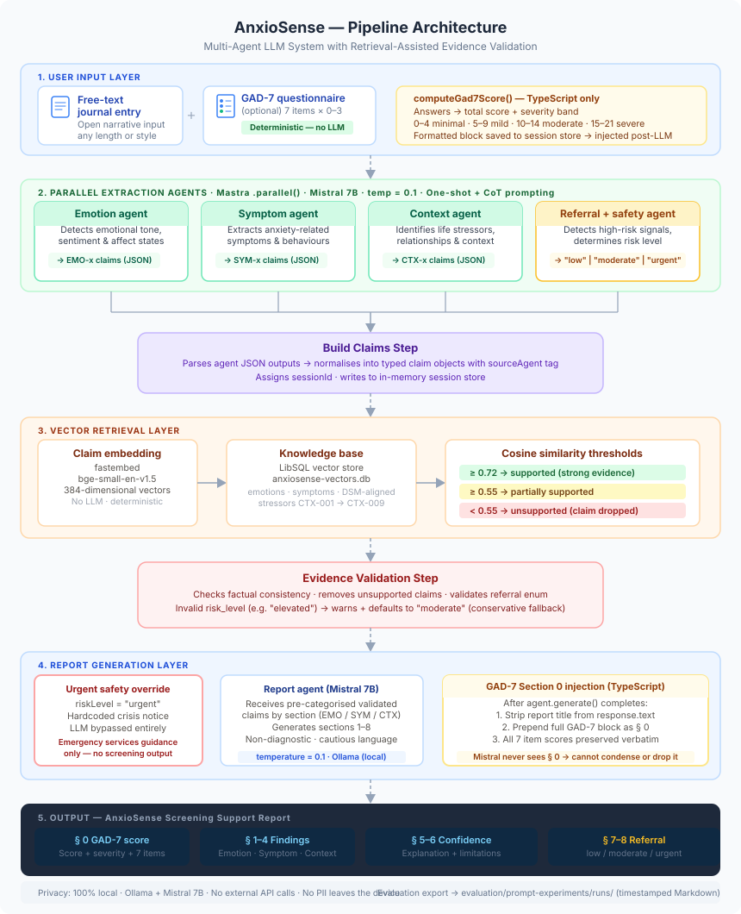

# AnxioSense

**A Multi-Agent Retrieval-Augmented Framework for Explainable Anxiety Screening Support**

EECS 4080 Undergraduate Research Project · York University  
Supervised by Dr. Belle and Dr. Abel

---

## Overview

AnxioSense is a non-diagnostic anxiety screening support tool that combines a validated clinical instrument (GAD-7) with a multi-agent LLM pipeline to generate explainable, evidence-grounded screening reports. The system is not a diagnostic tool and does not replace clinical assessment.

**Two screening modes:**
- **Self-Assessment Mode** — user completes a journal entry and the GAD-7 questionnaire; the system produces a personalised report with a functional-impairment-adjusted recommendation
- **Social Media Mode** — user pastes social media text for anxiety-signal analysis without a clinical instrument

**Key architectural properties:**
- Six-agent parallel pipeline (Emotion, Symptom, Context, Referral, Report, Validation) via Mastra SDK
- RAG-grounded report generation over a curated clinical knowledge base
- Deterministic safety override that bypasses the LLM pipeline when crisis language is detected
- Functional impairment integration following Spitzer et al. (2006) GAD-7 guidelines
- Clinician mode for professional-facing report output

---

## Architecture



```
User input
    │
    ▼
[Safety Check]  ──→  Crisis detected: hardcoded crisis response (no LLM)
    │
    ▼  (no crisis)
[Pre-Assessment: GAD-7 scoring + discordance detection]
    │
    ├──── [Emotion Agent] ──┐
    ├──── [Symptom Agent] ──┤
    ├──── [Context Agent] ──┤  (parallel)
    └──── [Referral Agent] ─┘
                            │
                    [Claims Builder]
                            │
                    [RAG Retrieval]
                            │
                    [Evidence Validation]
                            │
                    [Report Generation]
                            │
                    Final report + referral level
```

Model: Llama 3.3 70B Versatile via Groq API  
Orchestration: Mastra SDK v1.42

---

## Deployment

| Service | URL | Stack |
|---|---|---|
| Frontend | https://anxiosense.vercel.app | React + MUI, Vercel |
| API Server | Railway (mellow-eagerness) | Express + Node |
| Mastra Pipeline | Railway (anxiosense) | Mastra + Llama via Groq |

---

## Repository Structure

```
anxiosense/
├── src/mastra/               # Mastra pipeline (agents, workflows, utilities)
│   ├── agents/               # Six LLM agents
│   ├── workflows/            # anxiety-screening-assessment-workflow.ts (main pipeline)
│   └── utils/                # GAD-7 scorer, recommendation logic, session store
├── server/                   # Express API server
│   └── src/
│       ├── routes/           # /api/workflow/run, /api/reports
│       └── utils/            # safetyCheck.ts, preAssess.ts, validateText.ts
├── frontend/                 # React + MUI frontend
│   └── src/
│       ├── pages/            # AssessmentPage, DashboardPage, ReportPage
│       └── components/       # GAD7Form, FunctionalImpairmentForm, ReportViewer
├── knowledge-base/           # RAG knowledge base (plain text, manually curated)
├── prompts/                  # Agent prompt files (per agent)
├── evaluation/               # Evaluation data, results, and protocol
│   └── prompt-experiments/   # Structured evaluation runs and analysis
└── docs/                     # Architecture diagrams, literature comparison
```

---

## Local Development

### Prerequisites

- Node.js ≥ 22.13.0
- Groq API key
- Google OAuth credentials (for authentication)

### Environment variables

Copy `.env.example` to `.env` and fill in:

```
GROQ_API_KEY=
GOOGLE_CLIENT_ID=
GOOGLE_CLIENT_SECRET=
JWT_SECRET=
MASTRA_URL=http://localhost:4111
```

For the server (`server/.env`):
```
JWT_SECRET=
GOOGLE_CLIENT_ID=
GOOGLE_CLIENT_SECRET=
MASTRA_URL=http://localhost:4111
```

For the frontend (`frontend/.env`):
```
VITE_API_URL=http://localhost:3001
VITE_GOOGLE_CLIENT_ID=
```

### Running locally

**1. Start the Mastra pipeline (port 4111):**
```bash
npm run dev
```

**2. Start the Express server (port 3001):**
```bash
cd server && npm run dev
```

**3. Start the frontend (port 5173):**
```bash
cd frontend && npm run dev
```

### Indexing the knowledge base

```bash
npm run index-kb
```

---

## Testing

**Server tests (validateText, preAssess, safetyCheck):**
```bash
cd server && npm test
```
Expected: 134 tests, 0 failures

**Mastra utility tests (recommendation logic):**
```bash
npm test
```
Expected: 56 tests, 0 failures

---

## Key Design Decisions

**Deterministic safety before AI.** The crisis language detector uses pattern matching, not an LLM, because safety decisions must be predictable and testable. An LLM-based safety filter can produce inconsistent results; a deterministic regex-based check cannot hallucinate a safe response.

**GAD-7 as structured input, not prediction target.** Most clinical NLP systems predict PHQ-9/GAD-7 scores from passive text. AnxioSense inverts this: the GAD-7 is administered as structured input, and the LLM provides a perpendicular textual analysis. Discordance between the two is detected and flagged.

**Functional impairment follow-up.** Following Spitzer et al. (2006), the standard GAD-7 functional impairment question is asked after the questionnaire. The response does not change the score — it is used to select from 16 pre-defined patient-facing recommendations (4 severity levels × 4 impairment levels).

**Claim-level validation.** The validation agent audits each generated report claim against the clinical knowledge base. This separates report generation from evidence verification.

---

## Scope and Limitations

AnxioSense is a research prototype. It is not a diagnostic tool, a crisis service, or a replacement for clinical assessment. The system's outputs should not be used to make clinical decisions.

The safety override provides a response to crisis language but is not a substitute for emergency services or trained crisis counselling.

---

## Citation

If you use AnxioSense in research, please cite:
> Dassouki, A. (2026). *AnxioSense: A Multi-Agent Retrieval-Augmented Framework for Explainable Anxiety Screening Support*. EECS 4080 Research Report, York University.

---

## License

For academic research use only. All rights reserved.
